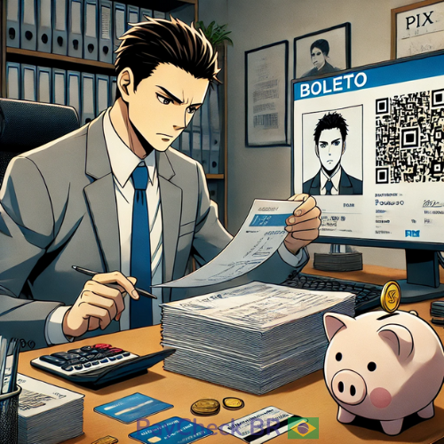

  

# PayCheckBR

### Validador Inteligente de Meios de Pagamento — Pix, Cartões e Boletos.

👋 **Olá, dev!**

O **PayCheckBR** é uma aplicação focada na transparência e validação técnica de meios de pagamento brasileiros. O projeto foi estruturado com os princípios de **Staff-level Engineering**, priorizando a simplicidade sofistica, resiliência e documentação através do código (**Narrative Coding**).

Este projeto é voltado para estudos e para compartilhar conhecimento com a comunidade sobre a anatomia de transações financeiras.

---

## 🚀 Tecnologias e Arquitetura

O projeto foi modernizado para utilizar os padrões mais recentes da indústria:

-   **ES Modules (ESM)**: Módulos nativos para uma estrutura limpa e manutenível.
-   **Vitest**: Suíte de 22 testes unitários automatizados garantindo a integridade dos cálculos (Luhn, Mod10, Mod11, CRC16).
-   **GitHub Actions**: Pipeline de CI/CD para validação automática em cada alteração.
-   **Narrative Coding**: Nomes expressivos e lógica autodocumentada seguindo padrões **EMV-QRCPS**, **FEBRABAN** e **ISO-IEC 7812**.

---

## 📚 Documentação Técnica

Explore a anatomia de cada meio de pagamento:

-   [Validação de Pix (EMV QRCPS)](src/assets/docs/pix.md)
-   [Validação de Cartão (ISO/IEC 7812)](src/assets/docs/cartao.md)
-   [Validação de Boleto (FEBRABAN)](src/assets/docs/boleto.md)

---

## ⚡ Histórico de Mudanças

Acompanhe a evolução do projeto no [CHANGELOG.MD](CHANGELOG.MD).

---

## 🧭 Exemplos e Recursos Úteis

Aqui estão as referências técnicos e projetos que serviram de base para as especificações:

### PIX - Pagamento Instantâneo Brasileiro
- [Manual de Padrões para Iniciação do Pix](https://www.bcb.gov.br/content/estabilidadefinanceira/pix/Regulamento_Pix/II_ManualdePadroesparaIniciacaodoPix.pdf)
- [Manual BR Code (EMV)](https://www.bcb.gov.br/content/estabilidadefinanceira/spb_docs/ManualBRCode.pdf)
- [Validador de Testes (QR Decoder)](https://pix.nascent.com.br/tools/pix-qr-decoder/)

### Cartão de Crédito
- [Guia sobre validação de cartões de crédito](https://cleilsontechinfo.netlify.app/jekyll/update/2019/12/08/um-guia-completo-para-validar-e-formatar-cartoes-de-credito.html)
- [API para consulta BIN (ChargeBlast)](https://docs.chargeblast.com/reference/bin-lookup)

### Boleto Bancário
- [Significado dos Números do Código de Barras](https://www.tecmundo.com.br/banco/38818-o-que-significa-cada-numero-do-codigo-de-barras-de-um-boleto-ilustracao-.htm)
- [Anatomia de um Boleto](https://www.ttrix.com/apple/iphone/boletoscan/boletoanatomia.html)
- [Cálculo de Data de Vencimento e Fator](https://www.boletobancario-codigodebarras.com/2018/04/data-de-vencimento-e-valor.html)

---

Fique à vontade para explorar e contribuir! 🚀 Caso encontre algum erro ou tenha sugestões de melhoria, abra uma Issue ou envie um Pull Request.
