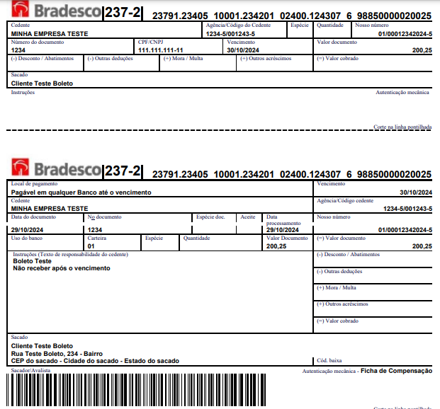

# Anatomia do Boleto Bancário

O boleto bancário é amplamente utilizado no Brasil para pagamentos de diversos tipos, incluindo contas de consumo,
tributos e serviços. A estrutura do boleto segue os padrões estabelecidos pela **Federação Brasileira de Bancos (
Febraban)**, que garante uma padronização das informações e da validação dos dados.

### Referência:

- [Tabela de Códigos de Compensação dos Bancos](https://www.bcb.gov.br/Fis/CODCOMPE/Tabela.pdf)

## Estrutura do Boleto

Existem dois formatos principais de boleto:

- **Linha Digitável**: sequência de 47 dígitos que facilita a leitura e o pagamento.
- **Código de Barras**: sequência de 44 dígitos que representa as mesmas informações da linha digitável.



### Componentes do Boleto Bancário

Abaixo, os principais componentes do boleto e suas funções:

1. **Código do Banco**:
    - Representa o código de compensação do banco emissor do boleto.
    - Exemplo: `237` para o Banco Bradesco.

2. **Dígito Verificador**:
    - Valida a integridade do boleto, garantindo que os dados foram digitados corretamente.

3. **Valor do Boleto**:
    - Indica o valor total a ser pago, localizado em posições específicas dependendo se é código de barras ou linha
      digitável.

4. **Fator de Vencimento**:
    - Calculado com base em uma data de referência, representa a data de vencimento do boleto.

5. **Linha Digitável e Código de Barras**:
    - A linha digitável é a sequência legível e segmentada para facilitar o pagamento. O código de barras contém o mesmo
      valor, mas sem separação.

### Exemplo de Código de Barras (44 dígitos)
```plaintext
23796988500000200251234010001234200240012430
```

Separado em segmentos conforme o padrão TLV (Type, Length, Value), incluindo os principais campos:

| **ID** | **Tipo**                   | **Tamanho**                  | **Valor**                                                                      |
|--------|----------------------------|------------------------------|--------------------------------------------------------------------------------|
| 1      | Tipo de Entrada            | 44 dígitos                   | Código de Barras                                                               |
| 2      | Banco                      | 3 dígitos (posição 1 a 3)    | 237 (Banco Bradesco)                                                           |
| 3      | Dígito Verificador         | 1 dígito (posição 5)         | ~~2379~~  **6**                                                                |
| 4      | Data de Vencimento         | 4 dígitos (posição 6 a 9)    | ~~23796~~  **9885** (30/10/2024)                                               |
| 5      | Valor                      | 10 dígitos (posição 10 a 19) | ~~237969885~~  **0000020025** (R$ 200,25)                                      |
| 6      | Linha Digitável Convertida | 47 dígitos                   | 23791.2340  **5** 10001.23420  **1** 02400.12430  **7**   **6** 98850000020025 |

### Exemplo de Linha Digitável (47 dígitos)
```plaintext
23791.23405 10001.234201 02400.124307 6 98850000020025
```

| **ID** | **Tipo**                    | **Tamanho**                     | **Valor**                                                             |
|--------|-----------------------------|---------------------------------|-----------------------------------------------------------------------|
| 1      | Tipo de Entrada             | 47 dígitos                      | Linha Digitável                                                       |
| 2      | Banco                       | 3 dígitos (posição 1 a 3)       | 237 (Banco Bradesco)                                                  |
| 3      | Dígitos Verificadores       | 3 dígitos (posições 10, 21, 32) | ~~237912340~~  **5**  ~~1000123420~~  **1**  ~~0240012430~~  **7**    |
| 4      | Dígito Verificador Geral    | 1 dígito (posição 33)           | ~~23791234051000123420102400124307~~  **6**                           |
| 5      | Data de Vencimento          | 4 dígitos (posição 34 a 37)     | ~~237912340510001234201024001243076~~  **9885** (30/10/2024)          |
| 6      | Valor                       | 10 dígitos (posição 38 a 47)    | ~~2379123405100012342010240012430769885~~  **0000020025** (R$ 200,25) |
| 7      | Código de Barras Convertido | 44 dígitos                      | 2379  **6**  988500000200251234010001234200240012430                  |

### Validação do Boleto

A validação do boleto utiliza dois principais métodos:
- **Mod10**: para validar segmentos específicos da linha digitável.
- **Mod11**: para o cálculo do dígito verificador do boleto.

Esses métodos de verificação garantem a segurança e a integridade das informações contidas no boleto, permitindo identificar e corrigir possíveis erros de digitação.

## Detalhes Avançados

Nesta seção, abordaremos detalhes específicos sobre a validação e o cálculo de componentes do boleto, incluindo o dígito
verificador, o fator de vencimento e a conversão entre linha digitável e código de barras. Vamos detalhar o processo com
códigos e explicações didáticas para facilitar o entendimento.

### Dígito Verificador

O dígito verificador no boleto é utilizado para garantir a integridade dos dados. Ele é calculado com base no método *
*Mod10** ou **Mod11**, dependendo da posição no boleto.

#### Código para Cálculo do Dígito Verificador usando Mod10

O Mod10 é um dos métodos usados para validar partes do boleto. Este método multiplica cada dígito por uma sequência
alternada de 2 e 1, soma os dígitos dos produtos e calcula o dígito verificador.

```javascript
function calculateMod10(value) {
    let sum = 0;
    let multiplier = 2; // Multiplicador inicial

    // Percorre os dígitos de trás para frente
    for (let i = value.length - 1; i >= 0; i--) {
        // Converte o caractere para número e multiplica pelo multiplicador atual (2 ou 1)
        let currentDigit = parseInt(value.charAt(i)) * multiplier;

        // Se o produto for maior que 9, soma os dígitos do produto
        // Exemplo: 14 vira 1 + 4 = 5
        if (currentDigit > 9) {
            currentDigit = Math.floor(currentDigit / 10) + (currentDigit % 10);
        }

        // Adiciona o valor ajustado à soma total
        sum += currentDigit;

        // Alterna o multiplicador entre 2 e 1
        multiplier = (multiplier === 2) ? 1 : 2;
    }

    // Calcula o dígito verificador (Mod10)
    const mod10 = sum % 10 === 0 ? 0 : 10 - (sum % 10);
    return mod10;
}

/* Exemplo de uso com valor a 1ª sequencia da linha digitável "237912340":

1. Multiplicação alternada (da direita para a esquerda):
    0 * 2 = 0
    4 * 1 = 4
    3 * 2 = 6
    2 * 1 = 2
    1 * 2 = 2
    9 * 1 = 9
    7 * 2 = 14 -> 1 + 4 = 5 (ajuste para soma dos dígitos do produto)
    3 * 1 = 3
    2 * 2 = 4

2. Resultados após o ajuste dos produtos maiores que 9:
    0, 4, 6, 2, 2, 9, 5, 3, 4

3. Soma total dos valores ajustados:
    0 + 4 + 6 + 2 + 2 + 9 + 5 + 3 + 4 = 35

4. Cálculo do dígito verificador:
    35 % 10 = 5
    Dígito verificador = 10 - 5 = 5

Resultado: O dígito verificador para "237912340" é 5
*/
```

**Explicação do Código:**

- O código começa multiplicando cada dígito do valor alternadamente por 2 e 1.
- Se o resultado de uma multiplicação for maior que 9, ele soma os dígitos do produto.
- O somatório final é dividido por 10. Se o resto for zero, o dígito verificador é 0. Caso contrário, o dígito é o
  complemento de 10 menos o resto.

#### Código para Cálculo do Dígito Verificador usando Mod11

O Mod11 é um método comumente usado para validar partes do boleto. Ele multiplica cada dígito por uma sequência
específica de pesos (43298765432...), soma os produtos e calcula o dígito verificador com base nessa soma.

```javascript
function calculateMod11(value) {
    /*
    Seqüência numérica de 2 a 9 ( 2, 3, 4, 5, 6, 7, 8, 9...), da direita para a esquerda 
    Como essa sequencia se repete para multiplicar os 43 algarismos do boleto,
    podemos defini-la com a posição fixa de 43 digitos.
    */
    const sequenceNumbers = "4329876543298765432987654329876543298765432"; // Sequência de pesos fixa
    let sum = 0;

    // Percorre cada dígito do valor e multiplica pelo peso correspondente da sequência
    for (let i = 0; i < value.length; i++) {
        sum += parseInt(value.charAt(i)) * parseInt(sequenceNumbers.charAt(i));
    }

    // Calcula o módulo 11 da soma
    const mod11 = sum % 11;
    let checksum = 11 - mod11;

    // Ajusta o dígito verificador caso o resultado seja 0, 1, 10 ou 11
    return checksum === 0 || checksum === 1 || checksum > 9 ? 1 : checksum;
}

/* Exemplo de uso com o código de barras "23796988500000200251234010001234200240012430"

1. Multiplicação com pesos:
    - Sequência de pesos: 4329876543298765432987654329876543298765432
    - Código de barras sem DV (remove 5ª posição): 2379988500000200251234010001234200240012430
    - Multiplicação de cada dígito do código com seu peso correspondente:
        2 * 4 = 8
        3 * 3 = 9
        7 * 2 = 14
        9 * 9 = 81
        9 * 8 = 72
        8 * 7 = 56
        8 * 6 = 48
        5 * 5 = 25
        0 * 4 = 0
        0 * 3 = 0
        0 * 2 = 0
        2 * 9 = 18
        0 * 8 = 0
        0 * 7 = 0
        2 * 6 = 12
        5 * 5 = 25
        1 * 4 = 4
        2 * 3 = 6
        3 * 2 = 6
        4 * 9 = 36
        0 * 8 = 0
        1 * 7 = 7
        0 * 6 = 0
        0 * 5 = 0
        0 * 4 = 0
        1 * 3 = 3
        2 * 2 = 4
        3 * 9 = 27
        4 * 8 = 32
        2 * 7 = 14
        0 * 6 = 0
        0 * 5 = 0
        2 * 4 = 8
        4 * 3 = 12
        0 * 2 = 0
        0 * 9 = 0
        1 * 8 = 8
        2 * 7 = 14
        4 * 6 = 24
        3 * 5 = 15
        0 * 4 = 0

2. Produtos individuais:
   - Todos os produtos calculados em sequência: 
     8, 9, 14, 81, 72, 56, 48, 25, 0, 0, 0, 18, 0, 0, 12, 25, 4, 6, 6, 36, 0, 7, 0, 0, 0, 3, 4, 27, 32, 14, 0, 0, 8, 12, 0, 0, 8, 14, 24, 15, 0

3. Soma total dos produtos:
   - Somando os produtos: 
     8 + 9 + 14 + 81 + 72 + 56 + 48 + 25 + 0 + 0 + 0 + 18 + 0 + 0 + 12 + 25 + 4 + 6 + 6 + 36 + 0 + 7 + 0 + 0 + 0 + 3 + 4 + 27 + 32 + 14 + 0 + 0 + 8 + 12 + 0 + 0 + 8 + 14 + 24 + 15 + 0
   
   - Soma de todos os produtos = 588

4. Cálculo do dígito verificador:
   - 588 % 11 = 5 -> Calcula o resto da divisão da soma total dos produtos por 11. Esse resto é chamado de mod11.
   - 11 - 5 = 6 -> Calcula o valor que precisamos adicionar ao resto (mod11) para que ele chegue ao próximo múltiplo de 11.
   
   Mais detalhes: 588 + 6 = 594 é o proximo multiplo de 11. 
   (594 / 11 = 54) ou (11 * 54 = 594), então 594 é múltiplo de 11 e 54 é o fator exato.

Resultado: O dígito verificador para "2379988500000200251234010001234200240012430" é 6
*/
```

### Fator de Vencimento

O fator de vencimento é calculado a partir de uma data base estabelecida pelo BACEN (07/10/1997). Ele representa o número de dias
entre essa data base e a data de vencimento do boleto.

Assim, um boleto bancário vencido em 31/12/2007, por exemplo, teria no campo "vencimento" os números: "3737". Os
números "3737" correspondem ao número de dias decorridos entre 07/10/1997 e 31/12/2007 (31/12/2007 - 07/10/1997 = 3737).

- [Data de Vencimento e Valor](https://www.boletobancario-codigodebarras.com/2018/04/data-de-vencimento-e-valor.html)

#### Código para Cálculo da Data de Vencimento

```javascript
function calculateDueDate(factor) {
   // Data base: 07/10/1997 em UTC - Tempo Universal Coordenado 
   // Exemplo de retorno Date.UTC: Tue Oct 07 1997 00:00:00 GMT+0000 (UTC)
   const refDate = new Date(Date.UTC(1997, 9, 7)); 
   const dueDays = parseInt(factor, 10);

   // Se o fator de vencimento for 0000, o boleto não tem data de vencimento
   if (dueDays === 0) {
     return "Sem vencimento";
   }
    
   // Calcula a data de vencimento somando os dias ao refDate
   // Converte os dias de vencimento em milissegundos (1 dia = 86.400.000 ms).
   // refDate.getTime() retorna 875404800000, que é o total de milissegundos entre 1º de janeiro de 1970 e 7 de outubro de 1997.
   const dueDate = new Date(refDate.getTime() + (dueDays * 86400000)); 
   
   // Retorna a data no formato DD/MM/AAAA
   return dueDate.toLocaleDateString('pt-BR', {timeZone: 'UTC'});
}
```

**Explicação do Código:**

- Definimos uma data base (07/10/1997) a partir da qual o fator de vencimento é calculado.
- O fator de vencimento representa a quantidade de dias que deve ser adicionada à data base para obter a data de
  vencimento.
- Se o fator de vencimento for `0000`, o boleto é considerado "Sem vencimento".
- A função retorna a data formatada no padrão brasileiro.

### Linha Digitável e Código de Barras

A linha digitável e o código de barras contêm a mesma informação, mas em formatos diferentes. A linha digitável tem 47
dígitos segmentados para facilitar a leitura, enquanto o código de barras possui 44 dígitos contínuos.

#### Conversão entre Linha Digitável e Código de Barras

##### Código para Converter Linha Digitável em Código de Barras

```javascript
function convertLineToBarCode(bankSlipLine) {
    // Verifica se a linha digitável tem exatamente 47 dígitos.
    if (bankSlipLine.length !== 47) {
        return null;
    }

    /* 
    A linha digitável possui 47 dígitos estruturados em diferentes seções que precisamos reorganizar para obter o código de barras de 44 dígitos.
    
    Exemplo de linha digitável:
    23791.23405 10001.234201 02400.124307 6 98850000020025
    
    Grupos de captura:
    1. `(\d{4})`: Captura os primeiros 4 dígitos, que representam o código do banco e a moeda. Exemplo: "2379"
    2. `(\d{5})`: Captura os próximos 5 dígitos, que fazem parte do campo livre. Exemplo: "12340"
    3. `\d{1}`: Ignora o próximo dígito (dígito verificador do primeiro campo) porque ele não é necessário para o código de barras.
    4. `(\d{10})`: Captura 10 dígitos seguintes, outra parte do campo livre. Exemplo: "1000123420"
    5. `\d{1}`: Ignora o próximo dígito (dígito verificador do segundo campo).
    6. `(\d{10})`: Captura mais 10 dígitos do campo livre. Exemplo: "0240012430"
    7. `\d{1}`: Ignora o próximo dígito (dígito verificador do terceiro campo).
    8. `(\d{15})`: Captura os últimos 15 dígitos, que contêm o fator de vencimento e o valor do boleto. Exemplo: "98850000020025"
    
    A sequência de substituição `'$1$6$2$3$4'` reorganiza esses grupos que são separados pelos parenteses para o formato de código de barras.
    */

    const barCode = bankSlipLine.replace(
        /^(\d{4})(\d{5})\d{1}(\d{10})\d{1}(\d{10})\d{1}(\d{15})$/,
        '$1$6$2$3$4'
    );

    /*
    Como funciona a sequência de substituição `'$1$6$2$3$4'`:
    
    - `$1`: Primeiro grupo de captura, os primeiros 4 dígitos que representam o banco e moeda (ex: "2379").
    - `$6`: Sexto grupo de captura, que é o dígito verificador geral, posicionado na quarta posição do código de barras.
    - `$2`, `$3`, `$4`: Os demais grupos de captura, contendo o campo livre e os valores necessários para o código de barras.
    
    O código reorganiza a linha digitável, excluindo os dígitos verificadores específicos de cada campo e mantendo apenas o dígito verificador geral.
    */

    return barCode;
}

// Exemplo: Convertendo "23791.23405 10001.234201 02400.124307 6 98850000020025"
// Resultado esperado do código de barras: "237968850000020025123401000123420124307"
```

**Explicação do Código:**

- A função verifica se a linha digitável possui 47 dígitos.
- Em seguida, reorganiza os campos da linha digitável para o formato correto do código de barras.
- A expressão regular ajuda a capturar os campos e rearranjá-los, gerando o código de barras final.

##### Código para Converter Código de Barras em Linha Digitável

```javascript
function convertBarCodeToReadableLine(barCode) {
    // Verifica se o código de barras tem exatamente 44 dígitos
    if (barCode.length !== 44) {
        return null;
    }

    /* 
    A linha digitável é formada por três campos principais de dados (Campo 1, Campo 2, e Campo 3),
    além de um campo de verificação geral (Campo 4) e um campo de vencimento e valor (Campo 5).
 
    Cada campo é extraído de seções específicas do código de barras e possui um dígito verificador que é calculado com Mod10.
    
    Exemplo de código de barras: 
    23796988500000200251234010001234200240012430
    */

    // Campo 1: Combina os primeiros 4 dígitos (banco e moeda) com parte do campo livre (dígitos de 20 a 24)
    const field1 = `${barCode.substring(0, 4)}${barCode.substring(19, 24)}`;
    // Calcula o dígito verificador do Campo 1 usando o método Mod10
    const field1Dv = calculateMod10(field1);

    // Campo 2: Captura os dígitos de 25 a 34 do código de barras para formar o segundo campo da linha digitável
    const field2 = barCode.substring(24, 34);
    // Calcula o dígito verificador do Campo 2
    const field2Dv = calculateMod10(field2);

    // Campo 3: Captura os dígitos de 35 a 44 do código de barras para o terceiro campo
    const field3 = barCode.substring(34, 44);
    // Calcula o dígito verificador do Campo 3
    const field3Dv = calculateMod10(field3);

    // Campo 4: Captura o dígito verificador geral na posição 5 do código de barras
    const field4 = barCode.charAt(4);

    // Campo 5: Captura o fator de vencimento e o valor (dígitos de 6 a 19) para compor a parte final
    const field5 = barCode.substring(5, 19);

    /*
    Formata a linha digitável combinando os campos e seus dígitos verificadores:
    - Cada campo (field1, field2, field3) é dividido em duas partes e possui um dígito verificador específico.
    - Campo 4 e Campo 5 são adicionados no final para completar a linha digitável.
    */

    return `${field1.substring(0, 5)}.${field1.substring(5)}${field1Dv} ` +
           `${field2.substring(0, 5)}.${field2.substring(5)}${field2Dv} ` +
           `${field3.substring(0, 5)}.${field3.substring(5)}${field3Dv} ` +
           `${field4} ${field5}`;
    
    /*
    Exemplo de quebra dos campos no retorno:
    Campo 1: 23791.23405
    Campo 2: 10001.234204
    Campo 3: 02400.124307
    Campo 4: 6
    Campo 5: 98850000020025
    
    Linha Digitável Final:
    23791.23405 10001.234204 02400.124307 6 98850000020025
     */
}

// Exemplo com o código de barras "23796988500000200251234010001234200240012430"
// Resultado esperado da linha digitável: "23791.23405 12340.100012 34200.240012 6 98850000020025"
```

**Explicação do Código:**

- A função verifica se o código de barras tem 44 dígitos.
- Divide o código de barras em campos e calcula os dígitos verificadores para cada um usando o Mod10.
- Reorganiza os campos no formato da linha digitável e insere os dígitos verificadores nos locais corretos.
- Retorna a linha digitável formatada.

Essas funções e explicações permitem entender melhor como cada componente do boleto é calculado e verificado.