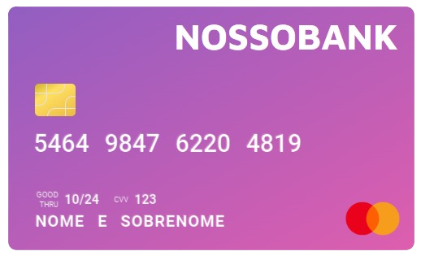

# Anatomia do Cartão de Crédito

O cartão de crédito é um dos métodos mais comuns para pagamentos digitais e físicos, possuindo uma estrutura padronizada
e estabelecida por entidades internacionais. Essa padronização garante a integridade das informações e a segurança nas
transações.

Para identificar se um cartão é de crédito ou débito de forma confiável, você geralmente precisaria de acesso à tabela
completa de IINs e de mais informações da instituição emissora.

## Estrutura do Cartão de Crédito

Os números dos cartões de crédito seguem um padrão estabelecido pela [ISO/IEC 7812](https://en.wikipedia.org/wiki/ISO/IEC_7812). Esse padrão define a composição do
número do cartão, incluindo as informações sobre o tipo de cartão e o emissor.



Obs: número gerado via [4devs](https://www.4devs.com.br/gerador_de_numero_cartao_credito), apenas para estudo.

### Componentes do Cartão de Crédito

Principais componentes do cartão e suas funções:

| **ID** | **Componente**                           | **Descrição**                                    | **Exemplo** |
|--------|------------------------------------------|--------------------------------------------------|-------------|
| 1      | Número de Identificação do Emissor (IIN) | Indica a bandeira e o emissor do cartão          | 546498      |
| 2      | Número do Titular                        | Identificação única para o titular               | 476220481   |
| 3      | Dígito Verificador                       | Verifica a integridade do cartão                 | 9           |
| 4      | Data de Validade                         | Informação sobre validade do cartão              | 10/24       |
| 5      | Valor de Verificação do Cartão (CVV)     | Valor de Verificação do Cartão - Segurança extra | 123         |

1. **Número de Identificação do Emissor (IIN - Issuer Identification Number)**:
   - **IIN** é uma sequência de **6 primeiros dígitos** do cartão, usada para identificar a instituição emissora (banco
     ou instituição financeira) e a bandeira (Visa, Mastercard, etc.).
   - O termo **BIN (Bank Identification Number)** é frequentemente utilizado como sinônimo de IIN, mas tecnicamente, *
     *IIN é o termo preferido, pois engloba não apenas bancos, mas outras instituições que emitem cartões**.
   - O IIN/BIN permite que os sistemas identifiquem rapidamente o tipo de cartão (crédito, débito, pré-pago) e a
     instituição emissora, mesmo antes de uma transação ser processada.
   - **Exemplo**: Nos cartões Visa, qualquer número que comece com "4" pertence a essa bandeira, enquanto cartões
     MasterCard têm números que começam entre "51" e "55" ou entre "2221" e "2720". [Maiores informações...](https://www.maquininha.com.br/como-saber-bandeira-cartao-pelo-numero/)

2. **Número do Titular**:
   - A sequência de dígitos entre o IIN e o dígito verificador corresponde à identificação única do titular dentro do
     banco emissor.
   - Esse número varia em tamanho, dependendo do comprimento total do cartão, que pode ter de 13 a 19 dígitos.

3. **Número do Cartão (PAN - Primary Account Number)**:
   - O **PAN** é o número completo do cartão, geralmente composto por 16 dígitos, onde os primeiros dígitos identificam
     o emissor (IIN/BIN) e o restante corresponde à conta do titular.
   - **Exemplo**: `5464 9847 6220 4819`.

4. **Dígito Verificador**:
   - O último dígito do número do cartão é o **dígito verificador**, usado para verificar a integridade do número do
     cartão.
   - Utiliza o **algoritmo de Luhn** (variação da Mod10), que ajuda a detectar possíveis erros de digitação.

5. **Data de Validade**:
   - Indica até quando o cartão é válido, geralmente no formato MM/AA. Após essa data, o cartão não é aceito em
     transações.
   - **Exemplo**: `10/24` indica que o cartão expira em outubro de 2024.

6. **Código de Segurança (CVV - Card Verification Value)**:
   - O **CVV** é um número de **3 a 4 dígitos** impresso na parte de trás do cartão (ou na frente, para cartões American
     Express), usado como medida adicional de segurança em transações sem a presença física do cartão, como compras
     online.
   - Para a maioria dos cartões (Visa, Mastercard, Discover), o CVV possui **3 dígitos**; já nos cartões American
     Express, ele tem **4 dígitos**.
   - O CVV não está armazenado no chip nem na tarja magnética do cartão, o que impede que ele seja facilmente clonado e
     ajuda a prevenir fraudes em caso de perda ou roubo de dados.

### Algoritmo e Geração do CVV

O algoritmo exato usado para gerar o CVV é mantido em segredo pelos emissores de cartão, mas o processo básico envolve:

1. **Dados Utilizados**:
   - **Número do Cartão (PAN - Primary Account Number)**: A sequência completa do número do cartão.
   - **Data de Validade**: Mês e ano de vencimento do cartão.
   - **Chave Secreta**: Uma chave única que cada emissor de cartão possui e mantém em segredo.

2. **Processo**:
   - Esses dados são combinados e processados por um algoritmo de hash ou de criptografia exclusivo.
   - O resultado é reduzido aos **3 ou 4 dígitos do CVV** impressos no cartão.

Por conta da chave secreta única, não é possível calcular o CVV sem acesso aos sistemas do emissor. Isso torna o CVV um
método seguro e eficiente para verificar a autenticidade das transações, mesmo que o número do cartão e a data de
validade estejam expostos.

---

### Exemplo com o Número "5464 9847 6220 4819"

Para ilustrar, vamos dividir o número "5464 9847 6220 4819":

- **5464 98**: Primeiros seis dígitos, que representam o IIN/BIN e indicam a bandeira e o emissor.
- **47622048**: Sequência intermediária identificando o titular.
- **9**: Dígito verificador, calculado com o algoritmo de Luhn.

### Diferença entre Cartões de Crédito e Débito

Tanto cartões de crédito quanto de débito usam a mesma estrutura e o algoritmo de Luhn para validação. A distinção entre
crédito e débito pode estar associada ao IIN/BIN, pois alguns emissores reservam prefixos específicos para crédito e
outros para débito. Contudo, essa distinção nem sempre é visível no número do cartão em si, pois depende de dados
internos da instituição emissora.

### Algoritmo de Validação (Luhn)

O algoritmo de Luhn é usado para validar o número do cartão, identificando erros comuns de digitação. Ele soma os
dígitos do número após aplicá-los a uma sequência específica de multiplicações.

```javascript
// O algoritmo de Luhn verifica se a soma ajustada dos dígitos é divisível por 10
function calculateLuhn(cardValue) {
   let sum = 0;
   let shouldDouble = false;

   // Percorre os dígitos de trás para frente
   for (let i = cardValue.length - 1; i >= 0; i--) {
      let digit = parseInt(cardValue.charAt(i));

      // Se shouldDouble for verdadeiro, multiplica o dígito por 2
      if (shouldDouble) {
         digit = digit * 2;

         // Se o produto for maior que 9, subtrai 9 para ajustar o valor
         // Exemplo: 14 vira 1 + 4 = 5
         if (digit > 9) {
            digit = digit - 9;
         }
      }

      // Adiciona o valor ajustado à soma total
      sum += digit;

      // Alterna o multiplicador para o próximo dígito
      shouldDouble = !shouldDouble;
   }

   // Retorna verdadeiro se a soma for divisível por 10, indicando um número válido
   return sum % 10 === 0;
}

/* Exemplo de uso com o número do cartão "5464 9847 6220 4819":

1. Multiplicação alternada (da direita para a esquerda):
   - 9 * 2 = 18 -> 1 + 8 = 9
   - 1 * 1 = 1
   - 8 * 2 = 16 -> 1 + 6 = 7
   - 4 * 1 = 4
   - 2 * 2 = 4
   - 2 * 1 = 2
   - 6 * 2 = 12 -> 1 + 2 = 3
   - 2 * 1 = 2
   - 7 * 2 = 14 -> 1 + 4 = 5
   - 4 * 1 = 4
   - 8 * 2 = 16 -> 1 + 6 = 7
   - 9 * 1 = 9
   - 4 * 2 = 8
   - 6 * 1 = 6
   - 5 * 2 = 10 -> 1 + 0 = 1

2. Resultados após o ajuste dos produtos maiores que 9:
   1, 6, 8, 4, 7, 9, 7, 4, 5, 2, 3, 2, 4, 7, 1, 9

3. Soma total dos valores ajustados:
   1 + 6 + 8 + 4 + 7 + 9 + 7 + 4 + 5 + 2 + 3 + 2 + 4 + 7 + 1 + 9 = 80

4. Cálculo da verificação:
   80 % 10 = 0

Resultado: O número "5464 9847 6220 4819" é válido.
*/
```

Explicação do Código:

Cada dígito é multiplicado alternadamente por 2 e 1, e valores maiores que 9 têm seus dígitos somados.
A soma final é verificada; se o resultado for múltiplo de 10, o número é válido.

### Identificação da Bandeira

A bandeira do cartão pode ser determinada com base nos primeiros dígitos do número do cartão:

| **Bandeira**     | **Prefixo (IIN)**                | **Comprimento** |
|------------------|----------------------------------|-----------------|
| Visa             | 4                                | 13, 16          |
| MasterCard       | 51–55, 2221–2720                 | 16              |
| American Express | 34, 37                           | 15              |
| Discover         | 6011, 622126–622925, 644–649, 65 | 16              |
| JCB              | 3528–3589                        | 16              |

### Processo de Cobrança com Validação e Estorno

Em transações online, uma prática comum para validar os dados do cartão de crédito é realizar uma **cobrança temporária
** (ou pré-autorização) seguida de um **estorno imediato**. Esse processo é usado para garantir que o cartão fornecido
seja válido e que possui limite disponível, sem realmente efetuar uma cobrança definitiva.

#### Passo a Passo do Processo

1. **Captura dos Dados do Cartão**:
   - A aplicação solicita os dados necessários para a transação, incluindo:
      - **Número do Cartão (PAN)**
      - **Data de Validade**
      - **CVV**
      - **Nome do Titular**
   - Esses dados são geralmente criptografados para garantir a segurança durante a transmissão e o armazenamento
     temporário.

2. **Cobrança de Validação**:
   - Uma **pequena cobrança temporária** (ex.: R$1,00 ou um valor mínimo) é realizada na conta do cliente. Esta cobrança
     serve apenas para verificar se o cartão é válido e se possui limite disponível.
   - Esse valor fica reservado no cartão, mas não é realmente debitado, e o processo de pré-autorização não reduz o
     saldo disponível de forma definitiva.

3. **Estorno Automático**:
   - Após a validação, a cobrança temporária é **estornada automaticamente**. Isso devolve o valor ao saldo do cliente,
     finalizando o processo de verificação.
   - Esse estorno pode ser imediato ou levar alguns dias para aparecer no extrato do cliente, dependendo das políticas
     do emissor do cartão.

4. **Confirmação da Validação**:
   - Se a cobrança temporária foi bem-sucedida e estornada com sucesso, o cartão é considerado válido para futuras
     transações.
   - A aplicação pode prosseguir com uma cobrança real ou armazenar o token do cartão (caso seja um sistema que utilize
     tokenização para pagamentos futuros), garantindo segurança e conveniência.

#### Vantagens do Processo

- **Segurança**: Confirma se o cartão é válido e possui limite sem debitar um valor significativo.
- **Conveniência**: Automatiza a validação, reduzindo o risco de falhas em compras futuras.
- **Experiência do Usuário**: A cobrança temporária não impacta o saldo real, e o cliente não precisa se preocupar com
  cobranças não autorizadas.

Esse processo é amplamente usado em aplicativos e sistemas de pagamento para autenticar cartões de maneira segura e
eficaz antes de processar cobranças reais.