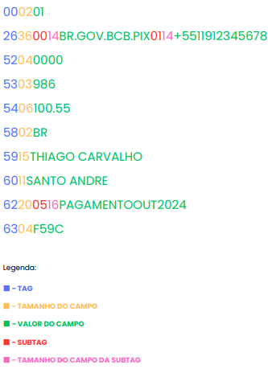

# Anatomia do PIX

O meio de pagamento PIX - Pagamento Instantâneo Brasileiro ganhou rápida popularidade desde seu lançamento, devido
a facilidade e velocidade na transação.

A estrutura do Pix é definida pelo **Manual de Padrões para Iniciação do Pix** do Banco Central do Brasil (BACEN), que
seguiu as diretrizes do **Manual do BR Code**.

Esses documentos detalham como o Pix deve ser implementado, incluindo a padronização dos códigos e das chaves Pix, além
das regras de segurança e verificação.

#### Referências:

- [Manual de Padrões para Iniciação do Pix](https://www.bcb.gov.br/content/estabilidadefinanceira/pix/Regulamento_Pix/II_ManualdePadroesparaIniciacaodoPix.pdf)
- [Manual BR Code](https://www.bcb.gov.br/content/estabilidadefinanceira/spb_docs/ManualBRCode.pdf)

Esses manuais são essenciais para desenvolvedores e instituições financeiras que desejam implementar o Pix em suas
plataformas de forma padronizada e segura.

## Tipos de Chave Pix

O sistema Pix permite o registro de diferentes tipos de chaves para vincular uma conta bancária a uma identificação
única. Aqui estão os principais tipos de chaves Pix:

1. **CPF ou CNPJ**:
    - Utiliza o número do **CPF** (para pessoas físicas) ou **CNPJ** (para empresas).
    - Exemplo: `123.456.789-00` (CPF) ou `12.345.678/0001-00` (CNPJ).

2. **Telefone**:
    - Vincula a conta bancária ao número de telefone do usuário.
    - O formato deve incluir o código do país (**+55** para o Brasil).
    - Exemplo: `+55 11 91234-5678`.

3. **E-mail**:
    - Utiliza um endereço de e-mail como chave Pix.
    - Exemplo: `exemplo@email.com`.

4. **Chave Aleatória**:
    - Uma sequência de caracteres gerada aleatoriamente pelo sistema do banco ou instituição financeira.
    - Não está vinculada a dados pessoais específicos.
    - Exemplo: `a1b2c3d4-e5f6-7890-gh12-ijklmnop3456`.

### Observações

- Uma pessoa ou empresa pode registrar até **5 chaves Pix** por conta bancária (pessoa física) ou até **20 chaves** (
  pessoa jurídica).
- Cada chave Pix é única e pode ser usada para facilitar transferências instantâneas de dinheiro.

### Exemplo de chave PIX - Copia e Cola

00020126360014BR.GOV.BCB.PIX0114+55119123456785204000053039865406100.555802BR5915THIAGO CARVALHO6011SANTO
ANDRE62200516PAGAMENTOOUT20246304F59C

Separando em segmentos conforme o padrão TLV (Type, Lenght, Value), incluindo as Subtags



## Anatomia do Pix em detalhes:

| **Posição** | **Tag** | **Length (Tamanho)** | **Value (Valor)**         | **Descrição**                          |
|-------------|---------|----------------------|---------------------------|----------------------------------------|
| 1 a 6       | `00`    | 02                   | `01`                      | Versão do formato Pix (versão 1)       |
| 7 a 12      | `26`    | 36                   | -                         | Merchant Account Information (MAI)     |
| 13 a 18     | `00`    | 14                   | `BR.GOV.BCB.PIX`          | Subtag: Domínio do BCB (Banco Central) |
| 19 a 24     | `01`    | 14                   | `+5511912345678`          | Chave Pix (telefone)                   |
| 25 a 30     | `52`    | 04                   | `0000`                    | Merchant Category Code (genérico)      |
| 31 a 36     | `53`    | 03                   | `986`                     | Código da moeda (BRL - Real)           |
| 37 a 44     | `54`    | 06                   | `100.55`                  | Valor da transação (R$ 100,55)         |
| 45 a 48     | `58`    | 02                   | `BR`                      | Código do país (Brasil)                |
| 49 a 63     | `59`    | 15                   | `THIAGO CARVALHO`         | Nome do recebedor                      |
| 64 a 74     | `60`    | 11                   | `SANTO ANDRE`             | Cidade do recebedor                    |
| 75 a 94     | `62`    | 20                   | -                         | Informações adicionais                 |
| 95 a 100    | `05`    | 16                   | `PAGAMENTOOUT2024`        | Subtag: Descrição do pagamento         |
| 101 a 106   | `63`    | 04                   | `F59C`                    | CRC (verificação do código)            |

### 1. `000201`

- **Tag `00`**: Indica a versão do Payload Pix.
- **Length `02`**: O tamanho do valor é 2 caracteres.
- **Value `01`**: Versão do formato Pix (versão 1).

### 2. `26360014BR.GOV.BCB.PIX`

- **Tag `26`**: Merchant Account Information (Informações da conta do recebedor).
- **Length `36`**: O valor tem 36 caracteres no total.

Agora, vamos dividir esse campo em subtags:

- **Subtag `00`**: Indica o tipo de informação da conta.
    - **Length `14`**: O valor dessa subtag tem 14 caracteres.
    - **Value `BR.GOV.BCB.PIX`**: Domínio do Banco Central, que indica que a transação é Pix e está sob a autoridade do
      Banco Central do Brasil.

### 3. `0114+5511912345678`

- **Tag `01`**: Chave Pix.
- **Length `14`**: O valor tem 14 caracteres.
- **Value `+5511912345678`**: Chave Pix no formato de número de telefone internacional (código do Brasil `+55`, DDD
  `11`, número `91234-5678`).

### 4. `52040000`

- **Tag `52`**: Merchant Category Code (Código de Categoria do Comerciante).
- **Length `04`**: O valor tem 4 caracteres.
- **Value `0000`**: Indica que não há uma categoria específica ou o valor é genérico para a transação.

### 5. `5303986`

- **Tag `53`**: Código da Moeda.
- **Length `03`**: O valor tem 3 caracteres.
- **Value `986`**: O código `986` representa o Real Brasileiro (BRL), a moeda da transação.

### 6. `5406100.55`

- **Tag `54`**: Valor da Transação.
- **Length `06`**: O valor tem 6 caracteres.
- **Value `100.55`**: O valor total da transação é R$ 100,55.

### 7. `5802BR`

- **Tag `58`**: País do Recebedor.
- **Length `02`**: O valor tem 2 caracteres.
- **Value `BR`**: O código `BR` representa Brasil, o país do recebedor.

### 8. `5915THIAGO CARVALHO`

- **Tag `59`**: Nome do Recebedor.
- **Length `15`**: O valor tem 15 caracteres.
- **Value `THIAGO CARVALHO`**: Nome do recebedor da transação, Thiago Carvalho.

### 9. `6011SANTO ANDRE`

- **Tag `60`**: Cidade do Recebedor.
- **Length `11`**: O valor tem 11 caracteres.
- **Value `SANTO ANDRE`**: Cidade do recebedor, Santo André.

### 10. `62200516PAGAMENTOOUT2024`

- **Tag `62`**: Informações Adicionais.
- **Length `20`**: O valor tem 20 caracteres.

Agora, vamos dividir o valor das informações adicionais:

- **Subtag `05`**: Descrição da transação.
    - **Length `16`**: O valor tem 16 caracteres.
    - **Value `PAGAMENTOOUT2024`**: Descrição da transação, que informa que é um pagamento referente a outubro de 2024.

### 11. `6304F59C`

- **Tag `63`**: CRC (Cyclic Redundancy Check).
- **Length `04`**: O valor tem 4 caracteres.
- **Value `F59C`**: Código de verificação (CRC), que é utilizado para garantir a integridade dos dados no código Pix.


Mais um exemplo, dessa vez usando os dados do Manual do Pix

00020101021126440014br.gov.bcb.spi0122fulano2019@example.com5204000053039865802BR5913FULANO DE TAL6008BRASILIA6304DFE3

| **Posição** | **Tag** | **Length (Tamanho)** | **Value (Valor)**        | **Descrição**                                                          |
|-------------|---------|----------------------|--------------------------|------------------------------------------------------------------------|
| 1 a 6       | `00`    | 02                   | `01`                     | Payload Format Indicator (Indica o formato do Payload Pix)             |
| 7 a 12      | `01`    | 02                   | `11`                     | Point of Initiation Method (Indica se o Pix é estático ou dinâmico)    |
| 13 a 58     | `26`    | 44                   | -                        | Merchant Account Information – PIX (Informações da conta do recebedor) |
| 13 a 28     | `00`    | 14                   | `br.gov.bcb.spi`         | Subtag: GUI (Identificador da autoridade que gerencia a chave - SPI)   |
| 29 a 50     | `01`    | 22                   | `fulano2019@example.com` | Subtag: Chave Pix (E-mail)                                             |
| 51 a 56     | `52`    | 04                   | `0000`                   | Merchant Category Code (Código de Categoria do Comerciante, genérico)  |
| 57 a 61     | `53`    | 03                   | `986`                    | Transaction Currency (Código da moeda, BRL - Real)                     |
| 62 a 65     | `58`    | 02                   | `BR`                     | Country Code (Código do país - Brasil)                                 |
| 66 a 79     | `59`    | 13                   | `FULANO DE TAL`          | Merchant Name (Nome do recebedor)                                      |
| 80 a 88     | `60`    | 08                   | `BRASILIA`               | Merchant City (Cidade do recebedor)                                    |
| 89 a 94     | `63`    | 04                   | `DFE3`                   | CRC16 (Cyclic Redundancy Check, verificação de integridade)            |


### 1. `000201`

- **Tag `00`**: Payload Format Indicator (Indica a versão do Payload Pix).
- **Length `02`**: O tamanho do valor é 2 caracteres.
- **Value `01`**: Versão do formato Pix (versão 1).

### 2. `010211`

- **Tag `01`**: Point of Initiation Method (Indica se o Pix é estático ou dinâmico).
- **Length `02`**: O tamanho do valor é 2 caracteres.
- **Value `11`**: Indica que o Pix é dinâmico. (12 indica que é estático)

### 3. `26440014br.gov.bcb.spi0122fulano2019@example.com`

- **Tag `26`**: Merchant Account Information – PIX (Informações da conta do recebedor).
- **Length `44`**: O valor tem 44 caracteres no total.

Agora, vamos dividir esse campo em subtags:

- **Subtag `00`**: GUI (Identificador da autoridade que gerencia a chave).
    - **Length `14`**: O valor dessa subtag tem 14 caracteres.
    - **Value `br.gov.bcb.spi`**: Indica que a transação está sob a autoridade do **Sistema de Pagamentos Instantâneos (
      SPI)** do Banco Central.
- **Subtag `01`**: Chave Pix.
    - **Length `22`**: O valor dessa subtag tem 22 caracteres.
    - **Value `fulano2019@example.com`**: Chave Pix no formato de e-mail.

### 4. `52040000`

- **Tag `52`**: Merchant Category Code (Código de Categoria do Comerciante).
- **Length `04`**: O valor tem 4 caracteres.
- **Value `0000`**: Indica que não há uma categoria específica ou o valor é genérico para a transação.

### 5. `5303986`

- **Tag `53`**: Código da Moeda.
- **Length `03`**: O valor tem 3 caracteres.
- **Value `986`**: O código `986` representa o Real Brasileiro (BRL), a moeda da transação.

### 6. `5802BR`

- **Tag `58`**: País do Recebedor.
- **Length `02`**: O valor tem 2 caracteres.
- **Value `BR`**: O código `BR` representa o Brasil, o país do recebedor.

### 7. `5913FULANO DE TAL`

- **Tag `59`**: Nome do Recebedor.
- **Length `13`**: O valor tem 13 caracteres.
- **Value `FULANO DE TAL`**: Nome do recebedor da transação.

### 8. `6008BRASILIA`

- **Tag `60`**: Cidade do Recebedor.
- **Length `08`**: O valor tem 8 caracteres.
- **Value `BRASILIA`**: Cidade do recebedor, Brasília.

### 9. `6304DFE3`

- **Tag `63`**: CRC (Cyclic Redundancy Check).
- **Length `04`**: O valor tem 4 caracteres.
- **Value `DFE3`**: Código de verificação (CRC), que é utilizado para garantir a integridade dos dados no código Pix.


## Cálculo do CRC

O **CRC (Cyclic Redundancy Check)** é utilizado no código Pix para garantir a integridade dos dados e assegurar que o
conteúdo do código não foi alterado. O valor CRC é gerado utilizando um algoritmo de verificação que cria uma soma de
verificação dos dados, permitindo detectar alterações acidentais.

#### Como funciona o cálculo do CRC no Pix?

1. **Algoritmo Utilizado**: O CRC no Pix utiliza o algoritmo **CRC-16/CCITT-FALSE**, que é amplamente utilizado em
   sistemas de verificação de dados. Esse algoritmo gera um valor de 16 bits a partir de uma sequência de dados, que é
   então anexado ao código Pix.

2. **Passos para o Cálculo do CRC**:

- **Entrada**: Todo o conteúdo do código Pix, desde a **Tag `00`** até a última informação antes do CRC (ou seja,
  excluindo o próprio campo CRC `63`).
- **Algoritmo**: O CRC é calculado com base nos dados da chave, utilizando o polinômio de 16 bits do algoritmo
  CRC-16/CCITT-FALSE. O polinômio padrão para esse cálculo é **0x1021**.
- **Valor Inicial**: O valor inicial utilizado no cálculo do CRC é **0xFFFF**.

3. **Inserção do CRC no código Pix**: Após calcular o valor CRC com base na entrada, o valor resultante (um hexadecimal
   de 4 dígitos) é inserido no campo **Tag `63`**, que corresponde ao CRC no Pix.

Considerando o PIX do exemplo, o final é 6304 (tag e tamanho do campo). Então, F59C é o valor do CRC.

Abaixo trecho do código para calcular e verificar o CRC:

```js
function validateCRC(pixCode) {
    const providedCRC = pixCode.slice(-4); // Últimos 4 caracteres fornecem o CRC
    const codeWithoutCRC = pixCode.slice(0, -4);
    const calculatedCRC = calculateCRC16(codeWithoutCRC);

    return calculatedCRC.toUpperCase() === providedCRC.toUpperCase();
}

function calculateCRC16(payload) {
    // O polinômio usado para calcular o CRC, conforme a especificação CRC-16/CCITT-FALSE
    // Esse valor é fixo: 0x1021 (binário: 0001 0000 0010 0001)
    let polynomial = 0x1021;

    // O valor inicial do CRC, sempre começa com 0xFFFF (65535 em decimal)
    let crc = 0xFFFF; // Exemplo: CRC inicial = 0xFFFF (binário: 1111 1111 1111 1111)

    // Loop que percorre cada caractere do `payload` (string de entrada)
    for (let i = 0; i < payload.length; i++) {
        // `payload.charCodeAt(i)` obtém o valor ASCII do caractere na posição `i`.
        // Exemplo: Se o caractere for 'A', o valor ASCII é 65 (binário: 0100 0001).
        let charValue = payload.charCodeAt(i);

        // Deslocamos o valor ASCII 8 bits para a esquerda (equivalente a multiplicar por 256)
        // Isso posiciona o valor nas 8 posições mais significativas para combinar com o CRC
        // Exemplo: 'A' (65) deslocado 8 bits para a esquerda vira 0x4100 (binário: 0100 0001 0000 0000)
        crc ^= (charValue << 8);

        // Agora, temos uma combinação entre o CRC atual e o valor do caractere deslocado.
        // Exemplo: Se o CRC era 0xFFFF, fazemos XOR com 0x4100 (ASCII do 'A' deslocado)
        // Resultado: 0xFFFF ^ 0x4100 = 0xBEFF (binário: 1011 1110 1111 1111)

        // Loop para processar os 8 bits do caractere
        for (let j = 0; j < 8; j++) {
            // Verificamos se o bit mais significativo (16º bit) do CRC atual é 1
            if ((crc & 0x8000) !== 0) { // 0x8000 é 1000 0000 0000 0000 em binário
                // Se o bit mais significativo for 1, deslocamos 1 bit para a esquerda
                // e aplicamos o polinômio com XOR (Exclusive OR)
                crc = (crc << 1) ^ polynomial;

                // Exemplo: Se crc = 0xBEFF (binário: 1011 1110 1111 1111),
                // Deslocar 1 bit à esquerda: 0x7DFF (binário: 0111 1101 1111 1110)
                // XOR com o polinômio (0x1021): 0x6DDE (binário: 0110 1101 1101 1110)
            } else {
                // Se o bit mais significativo for 0, apenas deslocamos o CRC 1 bit para a esquerda
                crc <<= 1;

                // Exemplo: Se crc = 0x6DDE (binário: 0110 1101 1101 1110),
                // Deslocar 1 bit à esquerda: 0xDBBC (binário: 1101 1011 1011 1100)
            }

            // Aplicamos a máscara 0xFFFF para garantir que o CRC permaneça como um valor de 16 bits
            // Isso remove qualquer excesso de bits que possa ter sido criado.
            crc &= 0xFFFF; // Exemplo: crc permanece 0xDBBC após a máscara
        }
    }

    // Depois de processar todos os caracteres, o CRC resultante é convertido para hexadecimal
    // A função `toString(16)` converte o valor numérico para hexadecimal
    // `toUpperCase()` converte para letras maiúsculas (padrão do CRC) e `padStart(4, '0')`
    // garante que o CRC tenha 4 dígitos (se for menor, preenche com zeros à esquerda)
    return crc.toString(16).toUpperCase().padStart(4, '0'); // Exemplo final: 'F59C'
}
```

Com essas informações fica um pouco mais claro como pode ser validada uma chave PIX.